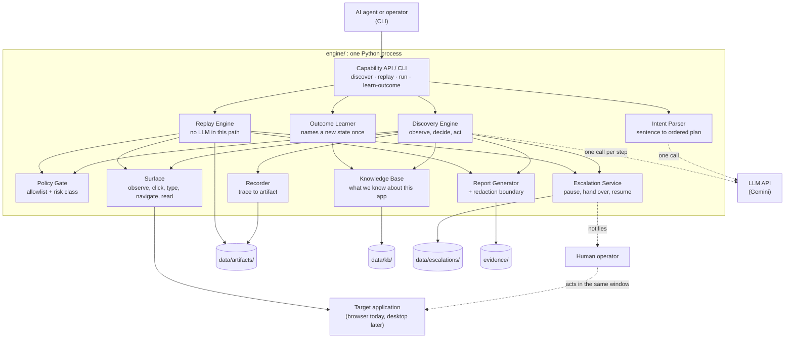
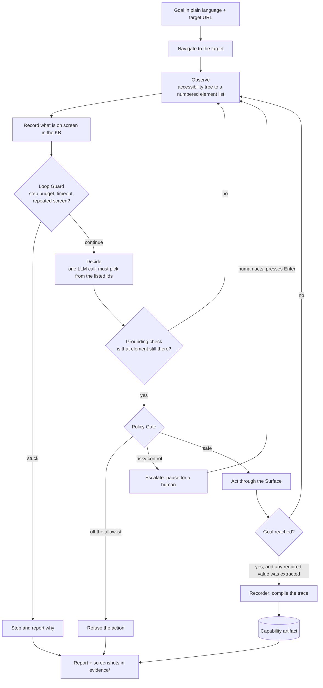
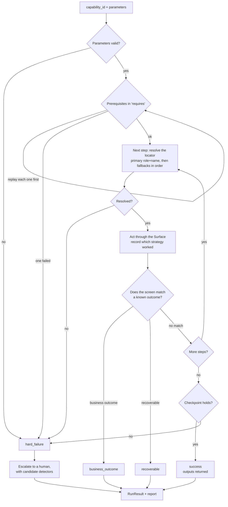
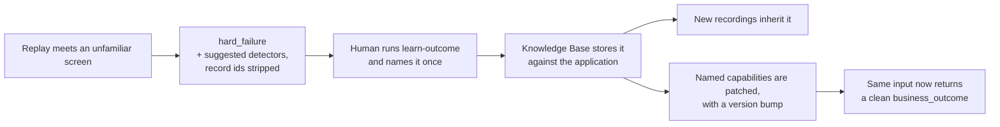

# Architecture

How the system is put together, and why each piece sits where it does.

The companion documents are [`REPORT.md`](REPORT.md), which argues the design decisions, and
[`README.md`](README.md), which is the guide to running it.

---

## 1. What the system does

An AI agent needs to use a business application that has no API. The only way in is the
screens a human operator uses.

This system solves that once per task, then stops paying for it:

1. **Discovery.** An LLM is given a URL and a goal written in plain language. It looks at the
   live screen, decides one action, takes it, and looks again, until the goal is reached.
2. **Recording.** The successful run is compiled into a **capability artifact**: a typed,
   versioned JSON contract describing the steps, the inputs it takes and the values it
   returns.
3. **Replay.** From then on the artifact is executed directly. No model is involved, the cost
   is a page load, and the behaviour is the same every time.

The engine knows nothing about any particular application. Nothing under `engine/` names a
screen, a route or a field. Point it at a different application and none of the code changes.

---

## 2. Components



Everything inside the box is one process. There are no queues and no services to deploy,
because at this size every boundary that would matter later is already a module boundary.

Three things are outside, and each is reached through exactly one component:

| Outside the engine | Reached only by | Why that matters |
|---|---|---|
| The LLM API | Discovery Engine (a call per step) and Intent Parser (one call, no actions) | Replay can be shown to use no model by reading the imports. It runs with no API key. |
| The target application | The `Surface` | Swapping browser for desktop touches one class, not the loop, the schema or replay. |
| The human operator | The Escalation Service | One pause and resume mechanism, used by both modes. |

Storage is split into four directories because each has a different write pattern:

| Path | Holds | Written by |
|---|---|---|
| `data/artifacts/` | One JSON capability per file. Reviewable in a pull request. | Recorder, and the Outcome Learner when it patches one |
| `data/kb/` | One JSON file per application: screens, elements, learned outcomes. | Discovery on every observation; the Outcome Learner |
| `data/escalations/` | Open intervention requests. | Escalation Service |
| `evidence/` | A report plus screenshots for every run, whatever the outcome. | Report Generator |

---

## 3. Discovery mode



Points worth knowing:

* **The model never invents a target.** Each observation hands it a numbered list of elements
  taken from the accessibility tree, and the tool schema for that turn only accepts ids from
  that list. A hallucinated element is rejected by the schema rather than by a prompt.
* **The grounding check runs between deciding and acting.** Ids are reassigned every turn, so
  the chosen element is confirmed to still be the same control before anything is clicked.
* **The Loop Guard watches for a run that cannot converge**, using a step budget, a wall clock
  timeout, and a hash of the screen to catch cycles. Typing and extracting do not contribute
  to that hash, otherwise a form with several fields would look stuck after one keystroke.
* **A goal that asks for a value must produce one.** If the model says it is finished without
  having extracted the value the goal names, the loop refuses once and says why. If it insists,
  the run still completes and the Recorder flags the artifact.
* **Secrets never reach the model.** The model sees the placeholder `{{password}}`. The real
  value is substituted inside the Surface call, at the keyboard.

---

## 4. Replay mode



**The four statuses are the contract.** Collapsing them into true or false throws away exactly
what the caller needs in order to decide what to do next.

| Status | Meaning | What the caller does |
|---|---|---|
| `success` | Every step ran and the checkpoint held. | Use the returned outputs. |
| `business_outcome` | The application correctly said no. | Treat it as an answer. "No such member" is a result, not a crash. |
| `recoverable` | Something transient interrupted the run, such as an expired session. | Retry, after replaying a prerequisite if the hint says so. |
| `hard_failure` | A state the artifact was never recorded to handle. | Stop. A human looks at it. |

**Locators are a ranked list.** Each step tries `role+name` first, because a role and an
accessible name survive markup changes, and falls back to a CSS selector only if that fails.
Replay records which strategy resolved each step, so a capability that starts relying on
fallbacks is visibly drifting before it breaks.

**Prerequisites are capabilities, not a session mechanism.** An artifact that declares
`requires: ["operator_login"]` causes that capability to be replayed first, with parameters
passed through by name. Signing on is something the system discovered and recorded, exactly
like everything else.

---

## 5. The capability artifact

One JSON file per capability. It is a contract, so a calling agent can decide whether to
invoke it by reading the artifact alone.

```jsonc
{
  "capability_id": "lookup_member_and_get_savings_balance",
  "version": "1.0.0",
  "status": "draft",                       // draft or approved; approval gates unattended use
  "target_app": { "app_id": "127.0.0.1_5050", "surface_type": "web" },
  "requires":   ["operator_login"],        // other capabilities, replayed first
  "input_params": [ { "name": "member_id", "type": "string", "secret": false } ],
  "outputs":      [ { "name": "savings_balance", "type": "currency", "source_step": "s4" } ],
  "steps": [
    { "step_id": "s3", "action": "click", "risk_class": "safe",
      "target": { "locator": {
        "primary":   { "strategy": "role+name", "value": "link:{{member_id}}" },
        "fallbacks": [ { "strategy": "css", "value": "…" } ] } } }
  ],
  "checkpoint": { "type": "element_present_with_pattern",
                  "pattern": "^[$€£]?[0-9,]+\\.[0-9]{2}$" },
  "known_outcomes": [ /* learned later; see section 6 */ ],
  "provenance": { "created_from_run": "discovery_…" }
}
```

Three properties make it reusable rather than a macro:

* **Caller values are templated out.** During discovery the result link was literally named
  `10001`. Stored that way, the capability would only ever work for one member. Substituting
  `{{member_id}}` back in makes the step mean "the member the caller named".
* **Outputs are named and typed.** A capability that navigates correctly but returns nothing
  is a script. The output name is chosen by the model at the moment it reads the value, which
  is the only point where the meaning of a table cell is known.
* **The checkpoint asserts a shape, not an answer.** Storing `$8,714.97` would fail the moment
  a balance changed. Storing the element plus a regular expression for its shape is a claim
  about future runs.

Routes are stored relative, never with a host, so the same artifact replays against another
deployment of the same application.

---

## 6. How the system learns what failure looks like

A discovery run only ever walks the success path, because it stops when the goal is met. So it
cannot observe how an application refuses. Those states are learned instead:



The first encounter being a hard failure is the design. The system has genuinely never seen
that state, and guessing that an unfamiliar red banner means "routine" rather than "the
database is down" is exactly the judgement it should not make on its own. The committed
evidence in `evidence/submission/06` and `07` shows the same input on either side of that
line.

An existing artifact is patched by name and its version is bumped, never edited silently,
because an artifact is a frozen contract and a reviewed capability should not quietly change
what it detects.

---

## 7. Safety

**The allowlist** is derived from the URL the operator aimed the run at, plus anything they
widened it to in the policy file. It is checked before every navigation in **both** modes.
Checking it during replay matters more than it looks: an artifact is data, it can be edited or
copied between environments, and replay is the mode that runs unattended.

**Risk classification is written in plain English and applies to any application.** A control
is risky if its accessible name contains a word like `confirm`, `submit`, `delete`, `approve`
or `transfer`. These are properties of interface vocabulary, so the list carries across a
banking console, a claims system and a hospital admin tool. A short list of exemptions is
checked first, so "Submit search" does not pause.

A risky control pauses for a human **during discovery**. During **replay** it is allowed,
because it was reviewed when the artifact was approved. The gate is the move from `draft` to
`approved`, not every execution, otherwise no capability that writes anything could ever run
unattended.

**Secrets** are passed as parameter names to the model and substituted at the keyboard. A
credential never appears in an API request, a trace, an artifact or a report.

**Redaction** is a real boundary: every screenshot is written through one function, so
production masking is one implementation rather than an audit of every call site. In this
repository that function is the identity function, because every record in the sample
application is invented.

---

## 8. Escalation and handoff

A run stops for a human in three cases: the Policy Gate meets a risky control, the Loop Guard
decides the run cannot converge, or a replay ends in `hard_failure` or `recoverable`.

The Escalation Service writes an `InterventionRequest` holding the capability, the goal, the
current step, the reason, and a redacted screenshot. It prints that context and blocks.

**The handover is real rather than simulated.** The browser runs visible by default, so the
window the agent was driving is the window the human takes over. There is no second session to
synchronise and no cookie transfer, because there is only one session. When the human presses
Enter, the run resumes by observing the screen again rather than assuming, since they may
legitimately have navigated somewhere unexpected. What they did is recorded in the evidence.

What is deliberately minimal is the operator's view: a console summary and a screenshot path
rather than a web console.

---

## 9. What the Surface sees

Each observation gathers three signals, chosen because they fail in different ways.

| Signal | Used for | Where it falls short |
|---|---|---|
| Accessibility tree: role, accessible name, value, state | The numbered element list the model must choose from, and the primary locator | A legacy element with no ARIA and no semantic HTML returns an empty or generic name |
| Screenshot | Telling apart controls that carry only an icon, and the evidence image for each step | Cannot produce a stable locator by itself, and costs tokens on every step |
| Raw DOM | Building a CSS fallback locator once the right element is already identified | Brittle against layout change, and too noisy to hand the model as context |

The accessibility tree is not the DOM. It is a semantic layer the browser computes for
assistive technology, out of HTML semantics, ARIA attributes and heuristics. It is what a
screen reader consumes, it exists on desktop platforms too through UIA, AX and AT-SPI, and it
survives markup churn that CSS selectors do not. That is why it is the primary signal and CSS
is only a fallback.

---

## 10. Decisions and the costs accepted

| Decision | Why | Cost accepted |
|---|---|---|
| One process, no queues or services | The brief prefers a working system over scaling infrastructure, and every seam that would matter later is already a module boundary | It will not scale horizontally without rework |
| Perception through the accessibility tree, CSS as fallback | Legacy enterprise screens rarely carry test ids, and roles and names survive redesigns | A surface with no usable tree, such as an application rendered as pixels, needs a new Surface built on OCR and vision |
| Discovery and replay as two engines, not one engine with a flag | "No model in production" is verifiable by reading the imports rather than trusting a branch | A little duplication in setup code |
| The engine knows nothing about any application | It can be pointed at anything, and a prompt describing one product's screens would need rewriting for the next | The system starts cold, so the first encounter with any refusal is a hard failure |
| Each artifact carries its own locators, with `kb_element_id` reserved for a shared registry | An artifact that stands alone can be reviewed on its own, which is what a capability library needs first | One element drifting is fixed once per artifact instead of once for all of them |
| Known outcomes learned once per application, then copied onto artifacts by name | A session timeout is a fact about the application, not about one capability | An artifact recorded before an outcome was learned does not pick it up until someone patches it |
| Playwright behind a `Surface` interface | Strongest option for the web today, and the interface is the seam a desktop driver would use | Desktop support is a design answer, not a running one |
| A sample application built for this system rather than a public sandbox | It is the only reliable way to trigger the exact refusals and failures replay is judged on | No validation against a real vendor product |
| No tenant dimension in the schema | Building plumbing for many tenants into a demo that has one is premature | Reuse across tenants is argued in `REPORT.md`, not demonstrated |
| Review for a shorter path kept manual and offline | A second model pass on every run would spend tokens to save tokens | Artifacts are not guaranteed to be the shortest route unless a human asks for the review |
