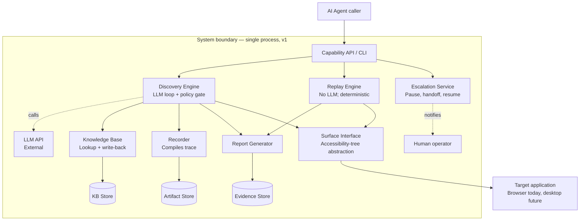
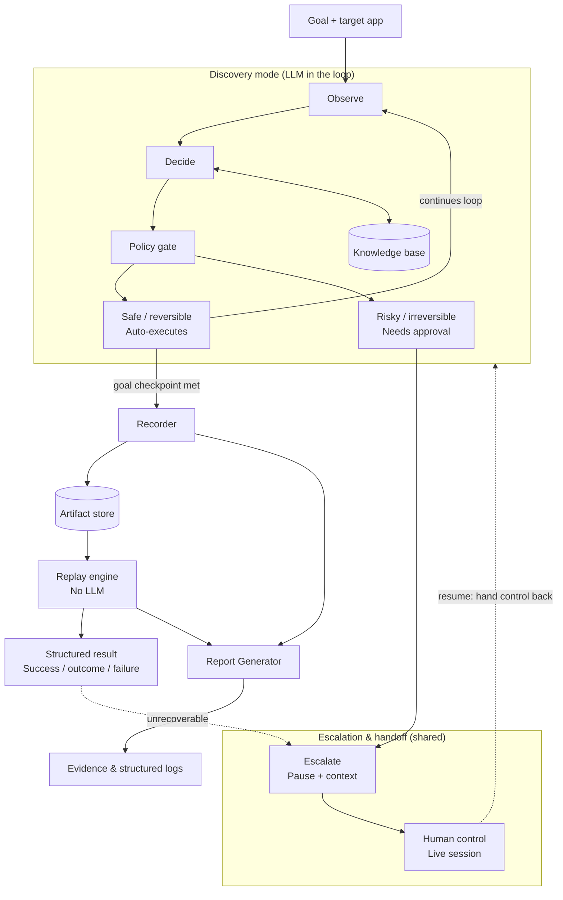

# Architecture — Computer-Use Automation System

## 1. Context & Goals

This system gives an AI agent the ability to operate back-office applications that expose no
API — the common case at banks and credit unions, where the only reliable interface is the one a
human operator sees and uses. It runs in two modes.

**Discovery** is an LLM-driven loop that observes a live UI, decides what to do, and acts, until a
goal is reached. It is used the first time a given capability is needed, and only then.

**Replay** executes a successful discovery run's recorded steps directly, with no LLM in the
decision loop, against stable element targeting. This is the path an AI agent actually invokes in
production: cheaply, deterministically, and without re-reasoning about the UI on every call.

The guiding principle throughout the design: the model discovers once, the artifact it produces
becomes a reusable capability, and deterministic replay is how that capability is invoked
thereafter.

---

## 2. System Architecture



Everything inside the system boundary runs as a single process, with no queues or separate
services. The only external dependencies are the LLM API, the target application, and the human
operator, each reached through a single, well-defined seam — the Discovery Engine is the only
component that calls the LLM, the Surface Interface is the only component that drives the target
application, and the Escalation Service is the only component that engages a human.

Storage is deliberately split into three stores rather than one, because each has a different
write pattern and retention need. The **Artifact Store** holds capabilities, written once per
successful discovery run and read on every replay. The **KB Store** holds the application's UI
map — its screens, elements, and navigation edges — incrementally patched as drift is detected and
shared across every artifact recorded against that application. The **Evidence Store** holds
append-only logs and human-readable reports from every run, regardless of outcome.

---

## 3. Discovery Mode Flow



Observe, decide, and the policy gate together form the entire discovery engine; there is no
separate code path for unattended execution. A goal that only touches safe, reversible actions
simply never trips the gate's human-approval branch and therefore runs unattended by construction,
rather than by a distinct "auto mode."

Escalation is shared infrastructure, fed from two places: the policy gate during discovery, and
the replay engine when it encounters a condition it was not recorded to handle. Both route through
the same pause, hand-off, and resume mechanism rather than duplicating it.

The Report Generator fires on every run outcome — success, business outcome, escalation, or hard
failure — not only on success as the Recorder does. A human reviewing a failed or escalated run
needs the narrated, screenshot-backed report precisely when something went wrong.

---

## 4. Observation & Signal Sources

Each call to Observe gathers three distinct signals, chosen to cover different failure modes of
legacy enterprise markup rather than redundantly repeating the same information.

| Signal | Primary use | Where it falls short |
|---|---|---|
| Accessibility tree (role, accessible name, value, state) | Source of the enumerated, ID-tagged action list the Decide step is constrained to; primary basis for locators | Legacy elements with no ARIA attributes or semantic HTML return an empty or generic name |
| Screenshot | Visual disambiguation for icon-only or unlabeled controls; becomes the per-step evidence image in the run report | Cannot itself produce a stable locator; meaningful multimodal token cost if attached on every step |
| Raw DOM | Last-resort locator construction (CSS selector or XPath) once an element has been identified by another signal | Brittle against layout change; too noisy to hand the LLM as reasoning context directly |

The accessibility tree is not the same thing as a browser's DOM inspector. A DOM inspector exposes
raw markup — tags, attributes, nesting — which is exactly the noisy layer this system treats as a
fallback rather than a primary signal. The accessibility tree is a separate, browser-computed
semantic layer intended for assistive technology, built from a mix of HTML semantics, ARIA
attributes, and heuristics; it is what the grounding logic and the locator strategy are built on
top of.

This layered approach is a direct response to inconsistent naming conventions in legacy
applications: a well-labeled element is captured cheaply and reliably by the accessibility tree
alone, while an unlabeled, icon-only control falls back to visual identification via screenshot,
with the raw DOM used only to construct a workable locator once the correct element has been
identified by one of the other two signals. A reasonable optimization for later iterations, noted
but not required for the initial implementation, is to attach a screenshot only when the
accessibility tree is ambiguous — for example, multiple elements of the same role with no
distinguishing name — rather than on every step unconditionally.

---

## 5. Design Decisions & Trade-offs

| Decision | Rationale | Trade-off accepted |
|---|---|---|
| Single process, no queues or separate services | Matches the brief's explicit preference against premature scaling infrastructure | Will not horizontally scale without rework; acceptable for an initial implementation |
| Accessibility-tree locators (`role + name`) as primary, CSS as last-resort fallback | Legacy enterprise UIs commonly lack test IDs; roles and accessible names survive layout churn that selectors do not | Requires the target surface to expose a usable accessibility tree |
| Locators live in the Knowledge Base; artifacts reference them by ID | A single drift fix propagates to every artifact using that element, instead of requiring each to be re-recorded | An artifact is no longer fully self-contained; understanding its current behavior requires reading the Knowledge Base as well |
| Known outcomes (business outcome / recoverable / hard failure) defined per artifact, not per application | Keeps each artifact a complete, standalone document a reviewer can understand without cross-referencing | Shared failure modes, such as a session timeout, are duplicated across artifacts rather than defined once |
| Playwright with the accessibility-snapshot API, behind a `Surface` abstraction | Strongest web automation option available today; the `Surface` interface is the seam that allows a desktop driver to be introduced later without touching the agent loop, artifact schema, or replay engine | Desktop support remains a design answer rather than a built implementation, consistent with the brief's scope |
| Grounding check positioned between Decide and the Policy Gate | Constrains the LLM to an enumerated, schema-validated action list resolved against live state, addressing the most common class of hallucination at the schema level rather than through prompting alone | Adds one verification step per action |
| Step budget, timeout, and state-hash cycle detection (Loop Guard) | Addresses runaway or cyclical behavior as a distinct failure mode from hallucination, since even a fully grounded agent can fail to converge | Hard limits may terminate a genuinely long legitimate flow; tunable per capability if this proves necessary |
| Target application: a self-built, legacy-styled mock rather than a public sandbox | The only reliable way to trigger the specific business-outcome, recoverable, and hard-failure conditions the replay engine is evaluated against | No validation against a real vendor product; accepted given the brief's prohibition on accessing a real bank system |
| Optimization review kept manual and offline, described in Section 5.1, rather than automated into the pipeline | Preserves token and cost efficiency by not running a second LLM pass on every discovery run | Artifacts are not guaranteed to be optimal unless a human actively invokes the review |

### 5.1 Optimization Review

Reaching a goal and reaching it by the most efficient path are not the same thing, particularly
early in an application's lifecycle, when the Knowledge Base is still sparse and discovery must
explore largely blind. Automating a second LLM pass to check every discovery run for optimality
would consume tokens in the pursuit of saving tokens, so this capability is intentionally excluded
from the automated pipeline and does not appear in the architecture diagrams above.

Instead, it is an optional, human-triggered review run against an already-completed artifact. The
review sends the full discovery trace — including any backtracking trimmed from the final recorded
path — to the LLM with a critique prompt rather than a task-completion prompt, and re-evaluates the
path against the Knowledge Base as it stands at review time rather than as it stood when the
artifact was originally recorded. A capability recorded early in an application's lifecycle may
have taken a longer route simply because a shorter one had not yet been discovered by a later
capability; this review surfaces that gap. It also compares LLM-call count against step count,
since a high ratio of calls to steps signals noisy grounding even when the final recorded artifact
appears clean.

The output is a note, not an automatic edit:

```json
"review": {
  "status": "not_reviewed",
  "optimization_notes": null,
  "reviewed_at": null
}
```

A human reads the note and decides whether re-recording is warranted. This sits outside the
draft-to-approved gate entirely: an artifact can be approved and used in production without ever
having been reviewed for optimality. It is a cost-hygiene tool for maintaining the artifact
library over time, not a correctness requirement.

---

## 6. Data Flow & Integration Points

Three external dependencies exist, each reached through exactly one component. The LLM API is
called only by the Discovery Engine, and only during the Decide step; the Replay Engine never
calls it. The target application is driven exclusively through the Surface Interface; no other
component addresses it directly. The human operator is engaged only through the Escalation
Service, which owns the pause, hand-off, and resume of the live session.

For a new goal, the flow runs from the AI Agent through the Capability API to the Discovery
Engine, which consults the Knowledge Base for guidance, passes every proposed action through the
Policy Gate, and acts through the Surface Interface. A successful run reaches the Recorder and is
written to the Artifact Store, with a parallel write to the Report Generator regardless of
outcome.

For a known capability, the flow runs from the AI Agent through the Capability API to the Replay
Engine, which reads the artifact from the Artifact Store and executes it through the Surface
Interface, producing a structured result. The Replay Engine escalates through the shared
Escalation Service only when it encounters a condition the artifact was not recorded to handle.

A redaction boundary sits ahead of both the Evidence Store and the Report Generator: screenshots
are passed through a redaction filter before being written, so the Report Generator only ever
reads already-redacted images. The Knowledge Base stores structural information only — roles,
labels, and locators — and never the underlying data values, account numbers, or names observed
on screen.

---

## 7. Requirements Traceability

The following maps this design against Section 3 of the take-home brief.

| Requirement | Design element |
|---|---|
| 3.1 — Goal-driven agent loop, observe → decide → act against a live surface | Discovery Engine, Section 3 |
| 3.1 — Mechanism functions without a clean DOM | Surface Interface's accessibility-tree abstraction, Section 4 |
| 3.2 — Structured, typed, versioned artifact | Artifact schema — ordered steps, typed inputs and outputs, checkpoint |
| 3.2 — Locator identification with robustness reasoning | Knowledge-Base-backed `role + name` primary locator with a fallback chain, Section 5 |
| 3.3 — Deterministic replay with no LLM in the decision loop | Replay Engine, Sections 2–3 |
| 3.3 — Three-way outcome split: business outcome, recoverable, hard failure | `known_outcomes` field in the artifact schema |
| 3.4 — Allowlist enforcement | Policy Gate, Section 3 |
| 3.4 — Conservative handling of risky or irreversible actions | Policy Gate risk classification and the Safe / Risky branches |
| 3.4 — No secrets or raw PII persisted | Redaction boundary, Section 6 |
| 3.5 — Structured log of agent actions and rationale | Evidence Store and Report Generator, Sections 2–3 |
| 3.5 — Richer signal on failure | Report Generator's per-step screenshots with highlighted elements |
| 3.6 — Detection of stuck states and routed intervention with context | Escalation Service, triggered from the Policy Gate and the Replay Engine |
| 3.6 — Human control of the same live session, with hand-back | Escalation & Handoff subsystem, Section 3 |
| 3.7 — Surface abstraction extensible to legacy web and desktop | The `Surface` interface seam, Section 5 (addressed as design, per the brief's scope) |
| 3.7 — Multi-tenant reuse without per-tenant rebuilds | Knowledge Base keyed by application template rather than tenant, with per-element overrides on drift |
| Hallucination mitigation | Grounding check between Decide and the Policy Gate, Section 5 |
| Infinite-loop mitigation | Loop Guard — step budget, timeout, and state-hash cycle detection, Section 5 |
