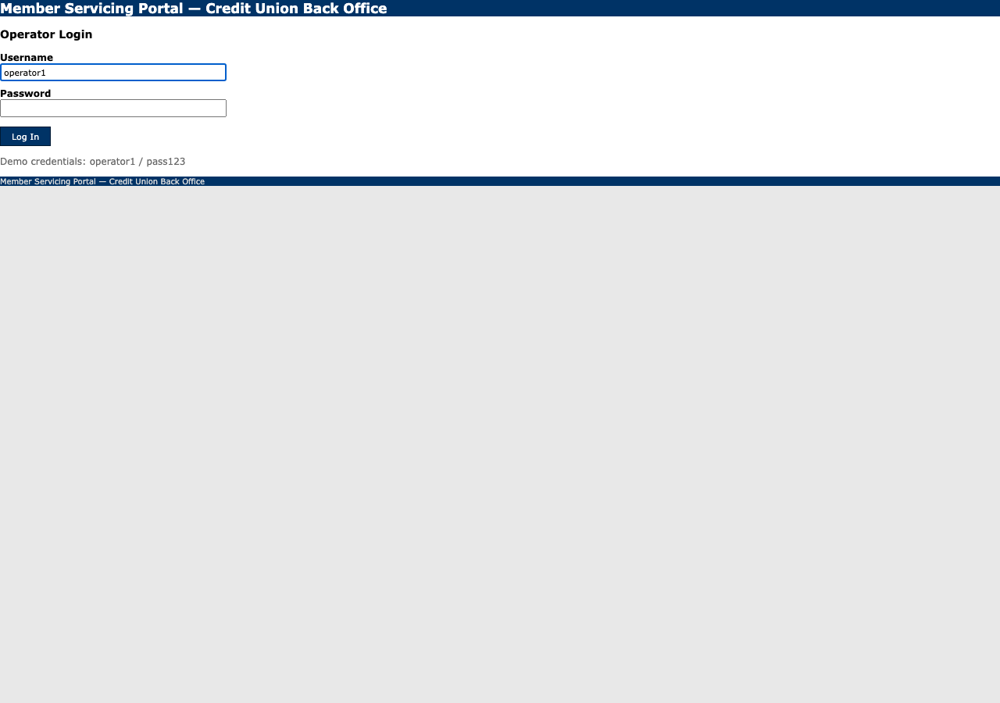

# Run report: Sign on to the console as the supplied operator

**Run id:** `discovery_20260915T035518_65dd5f`  
**Goal:** Sign on to the console as the supplied operator  
**Target:** 127.0.0.1_5050 (web)  
**Started:** 2026-09-15T03:55:18.225887+00:00 · **Duration:** 5.55s · **Outcome:** ✅ Goal reached

## Steps

### 1. type: Username

Typed {{username}} into textbox "Username".
*Rationale: Enter the supplied username into the username textbox.*
Locator: textbox:Username · Verified: ✓ · URL: `http://127.0.0.1:5050/login`

### 2. type: Password

Typed {{password}} into textbox "Password".
*Rationale: Enter the supplied password into the password textbox.*
Locator: textbox:Password · Verified: ✓ · URL: `http://127.0.0.1:5050/login`

### 3. click: Log In

Clicked button "Log In".
*Rationale: Click the Log In button to submit the login form.*
Locator: button:Log In · Verified: ✓ · URL: `http://127.0.0.1:5050/members/search`

## Result

**Status:** completed

**LLM calls:** 4 across 3 step(s)

**Final URL:** `http://127.0.0.1:5050/members/search`

**Evidence the model cited:** Signed on: operator1

**Stop reason:** model reported the goal was reached
