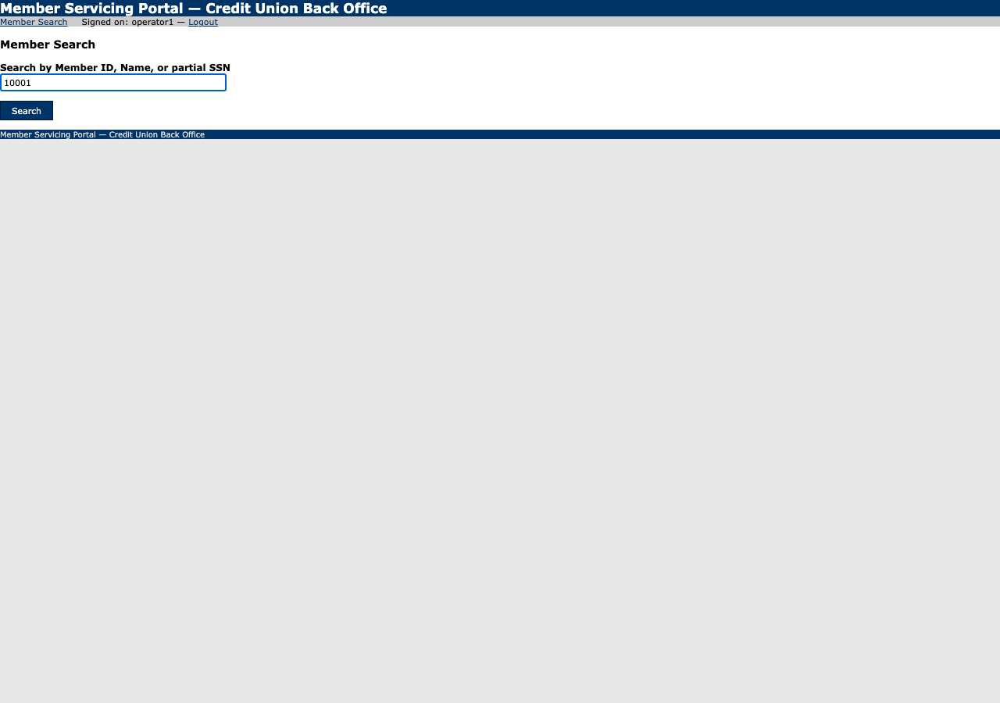
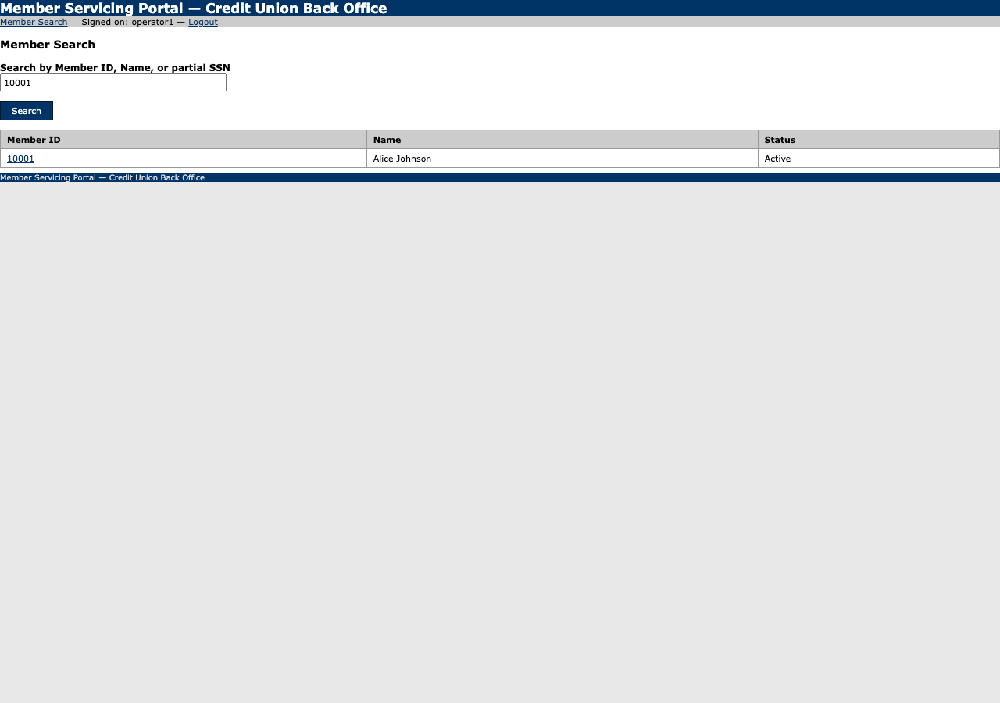
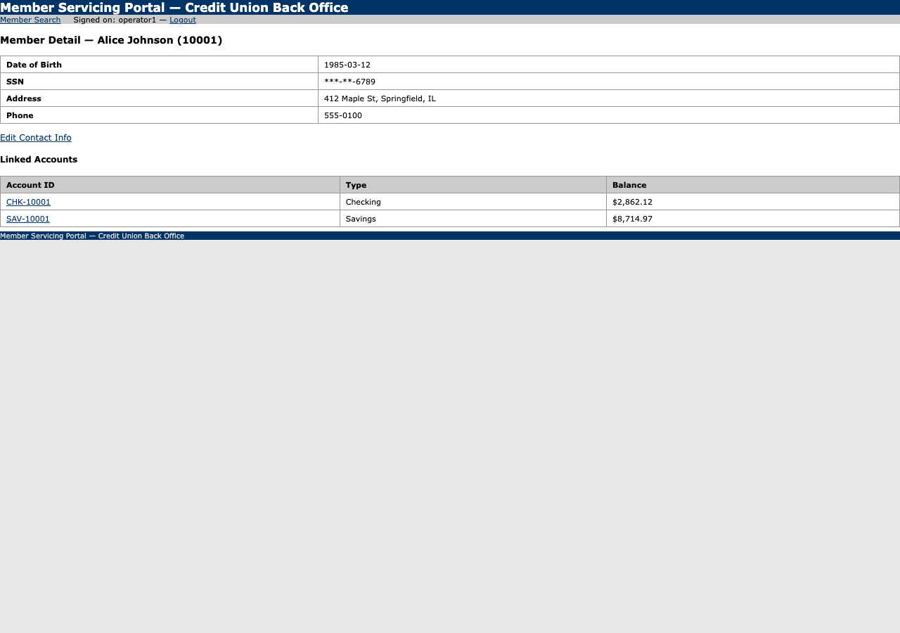

# Run report — Look up member 10001 and read their savings balance

**Run id:** `discovery_20260915T034656_e21f41`  
**Goal:** Look up member 10001 and read their savings balance  
**Target:** 127.0.0.1_5050 (web)  
**Started:** 2026-09-15T03:46:56.849888+00:00 · **Duration:** 7.27s · **Outcome:** ✅ Goal reached

## Steps

### 1. type — Search by Member ID, Name, or partial SSN

Typed {{member_id}} into textbox "Search by Member ID, Name, or partial SSN".
*Rationale: Type the member id placeholder into the search box to look up member 10001.*
Locator: textbox:Search by Member ID, Name, or partial SSN · Verified: ✓ · URL: `http://127.0.0.1:5050/members/search`

### 2. click — Search

Clicked button "Search".
*Rationale: Click the Search button to execute the search for member 10001.*
Locator: button:Search · Verified: ✓ · URL: `http://127.0.0.1:5050/members/search`

### 3. click — 10001

Clicked link "10001".
*Rationale: Click on member ID 10001 to view member details and find their savings balance.*
Locator: link:10001 · Verified: ✓ · URL: `http://127.0.0.1:5050/members/10001`

### 4. extract — $8,714.97

Read '$8,714.97' from cell "$8,714.97".
*Rationale: Extract the savings balance ($8,714.97) for member 10001 as required by the goal.*
Locator: cell:$8,714.97 · Verified: ✓ · URL: `http://127.0.0.1:5050/members/10001`

## Result

**Status:** completed

**LLM calls:** 5 across 4 step(s)

**Final URL:** `http://127.0.0.1:5050/members/10001`

**Evidence the model cited:** $8,714.97

**Stop reason:** model reported the goal was reached
