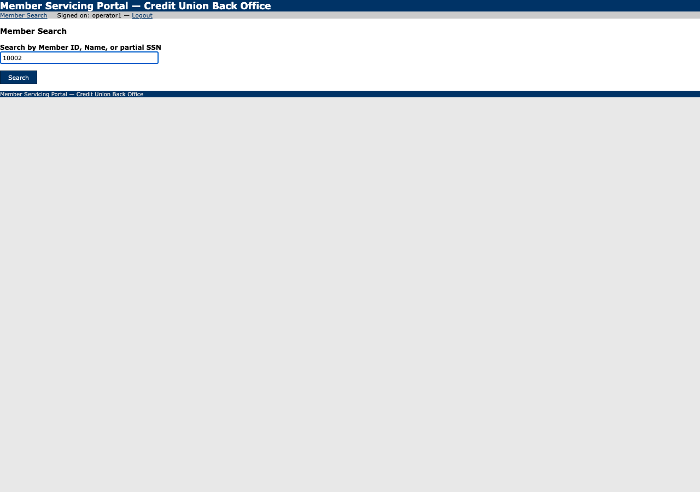
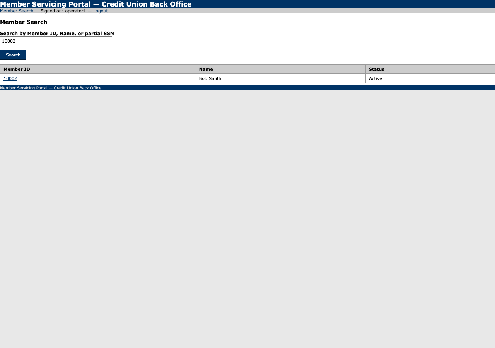
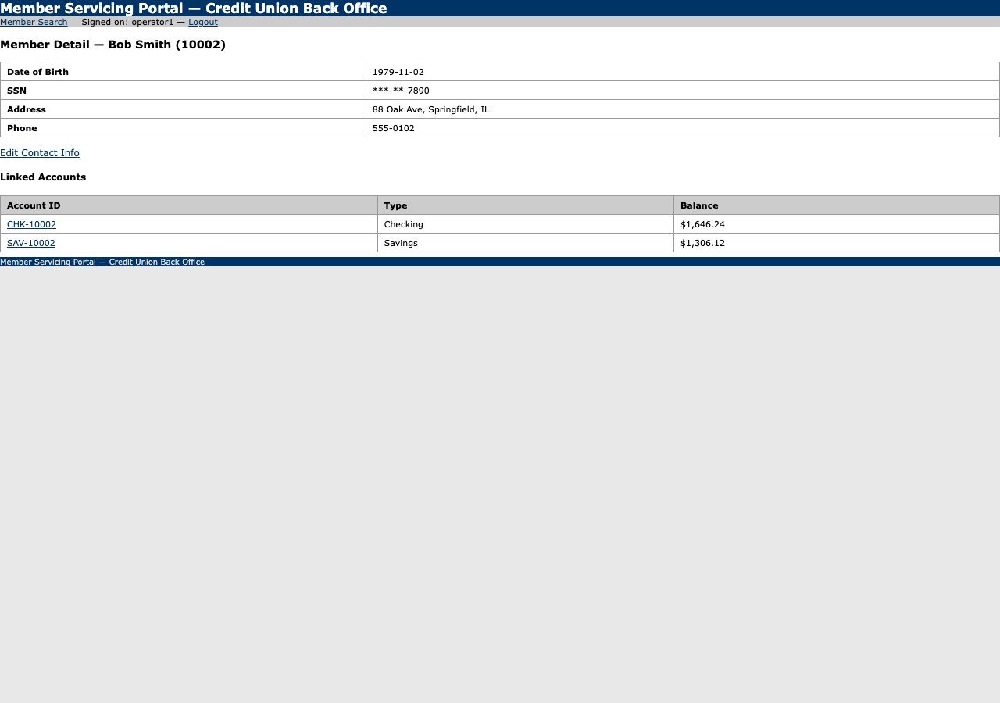
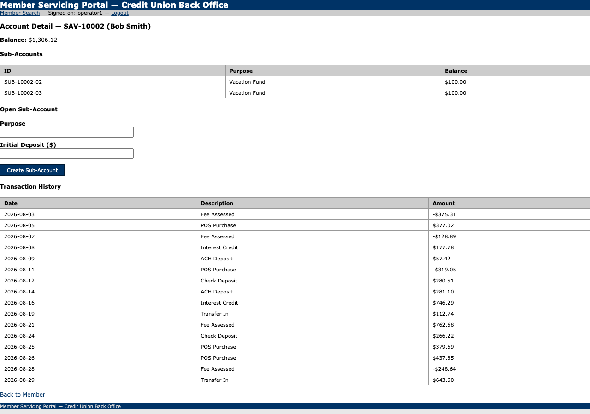
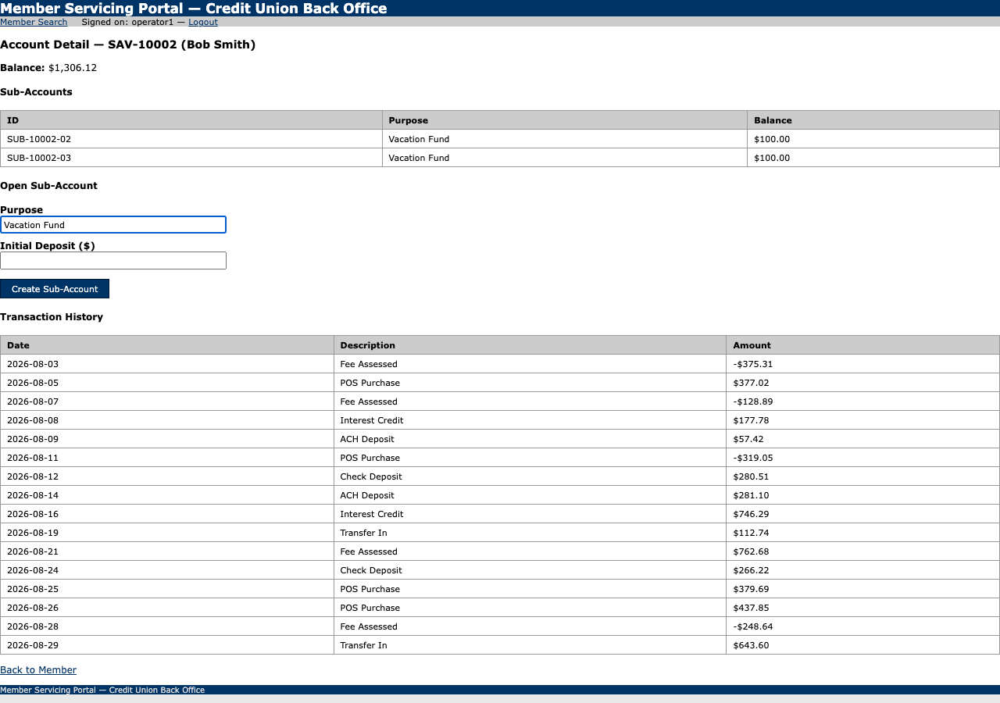
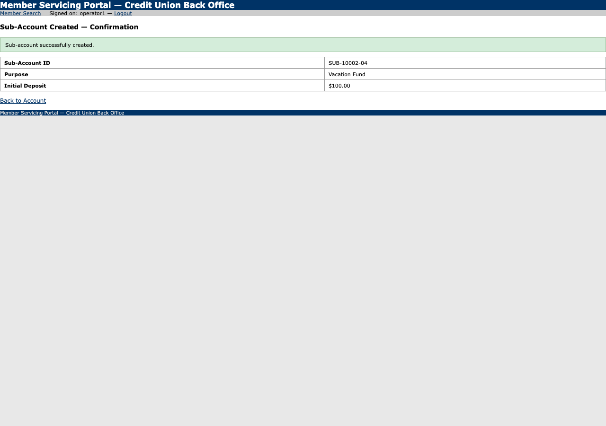

# Run report — Open member 10002's savings account, create a new sub-account with purpose 'Vacation Fund' and initial deposit 100, and reach the confirmation screen

**Run id:** `discovery_20260915T035635_6c61fa`  
**Goal:** Open member 10002's savings account, create a new sub-account with purpose 'Vacation Fund' and initial deposit 100, and reach the confirmation screen  
**Target:** 127.0.0.1_5050 (web)  
**Started:** 2026-09-15T03:56:35.686999+00:00 · **Duration:** 12.93s · **Outcome:** ✅ Goal reached

## Steps

### 1. type — Search by Member ID, Name, or partial SSN

Typed {{member_id}} into textbox "Search by Member ID, Name, or partial SSN".
*Rationale: Search for member 10002 using the placeholder as instructed.*
Locator: textbox:Search by Member ID, Name, or partial SSN · Verified: ✓ · URL: `http://127.0.0.1:5050/members/search`

### 2. click — Search

Clicked button "Search".
*Rationale: Click the Search button to execute the member search.*
Locator: button:Search · Verified: ✓ · URL: `http://127.0.0.1:5050/members/search`

### 3. click — 10002

Clicked link "10002".
*Rationale: Click on member 10002 to view member details.*
Locator: link:10002 · Verified: ✓ · URL: `http://127.0.0.1:5050/members/10002`

### 4. click — SAV-10002

Clicked link "SAV-10002".
*Rationale: Open member 10002's savings account (SAV-10002).*
Locator: link:SAV-10002 · Verified: ✓ · URL: `http://127.0.0.1:5050/accounts/SAV-10002`

### 5. type — Purpose

Typed {{purpose}} into textbox "Purpose".
*Rationale: Enter purpose 'Vacation Fund' using the placeholder {{purpose}}.*
Locator: textbox:Purpose · Verified: ✓ · URL: `http://127.0.0.1:5050/accounts/SAV-10002`

### 6. type — Initial Deposit ($)

Typed {{initial_deposit}} into textbox "Initial Deposit ($)".
*Rationale: Enter initial deposit 100 using the placeholder {{initial_deposit}}.*
Locator: textbox:Initial Deposit ($) · Verified: ✓ · URL: `http://127.0.0.1:5050/accounts/SAV-10002`

### 7. click — Create Sub-Account

Clicked button "Create Sub-Account".
*Rationale: Click Create Sub-Account button to submit the new sub-account.*
Locator: button:Create Sub-Account · Verified: ✓ · URL: `http://127.0.0.1:5050/accounts/SAV-10002/subaccount`

## Result

**Status:** completed

**LLM calls:** 8 across 7 step(s)

**Final URL:** `http://127.0.0.1:5050/accounts/SAV-10002/subaccount`

**Evidence the model cited:** Sub-account successfully created.

**Stop reason:** model reported the goal was reached
