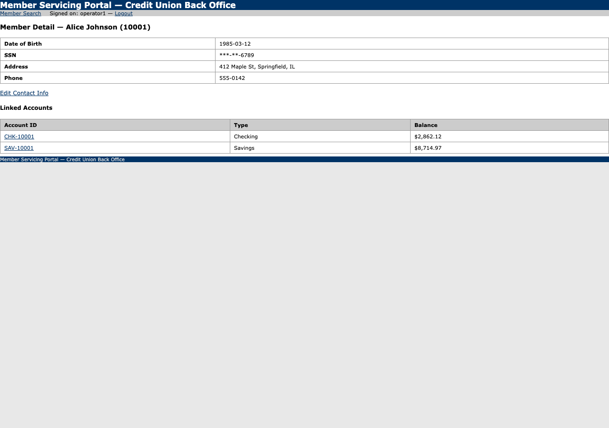

# Run report: lookup_member_and_get_savings_balance

**Run id:** `replay_lookup_member_and_get_savings_balance_20260915T040029_5cdcc2`  
**Goal:** Look up a member by ID and return their current savings balance.  
**Target:** 127.0.0.1_5050 (web)  
**Started:** 2026-09-15T04:00:29.658087+00:00 · **Duration:** 0.93s · **Outcome:** ✅ Success

## Steps

### 1. navigate: s0

Navigated to /.
Locator: n/a · Verified: ✓ · URL: `http://127.0.0.1:5050/login`

### 2. type: s1

Typed {{username}} into textbox "Username", entered 'operator1'.
Locator: primary · Verified: ✓ · URL: `http://127.0.0.1:5050/login`

### 3. type: s2

Typed {{password}} into textbox "Password", entered «redacted».
Locator: primary · Verified: ✓ · URL: `http://127.0.0.1:5050/login`

### 4. click: s3

Clicked button "Log In".
Locator: primary · Verified: ✓ · URL: `http://127.0.0.1:5050/members/search`

### 5. navigate: s0

Navigated to /.
Locator: n/a · Verified: ✓ · URL: `http://127.0.0.1:5050/members/search`

### 6. type: s1

Typed {{member_id}} into textbox "Search by Member ID, Name, or partial SSN", entered '10001'.
Locator: primary · Verified: ✓ · URL: `http://127.0.0.1:5050/members/search`

### 7. click: s2

Clicked button "Search".
Locator: primary · Verified: ✓ · URL: `http://127.0.0.1:5050/members/search`

### 8. click: s3

Clicked link "10001".
Locator: primary · Verified: ✓ · URL: `http://127.0.0.1:5050/members/10001`

### 9. extract: s4

Read '$8,714.97' from cell "$8,714.97", read '$8,714.97'.
Locator: primary · Verified: ✓ · URL: `http://127.0.0.1:5050/members/10001`

## Result

The capability completed and its checkpoint held.

- `savings_balance` = `$8,714.97`
