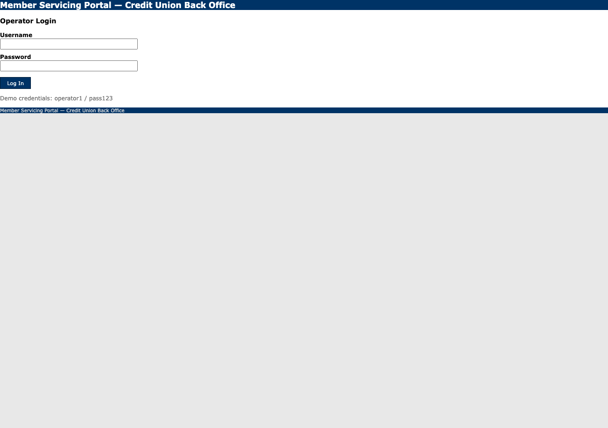
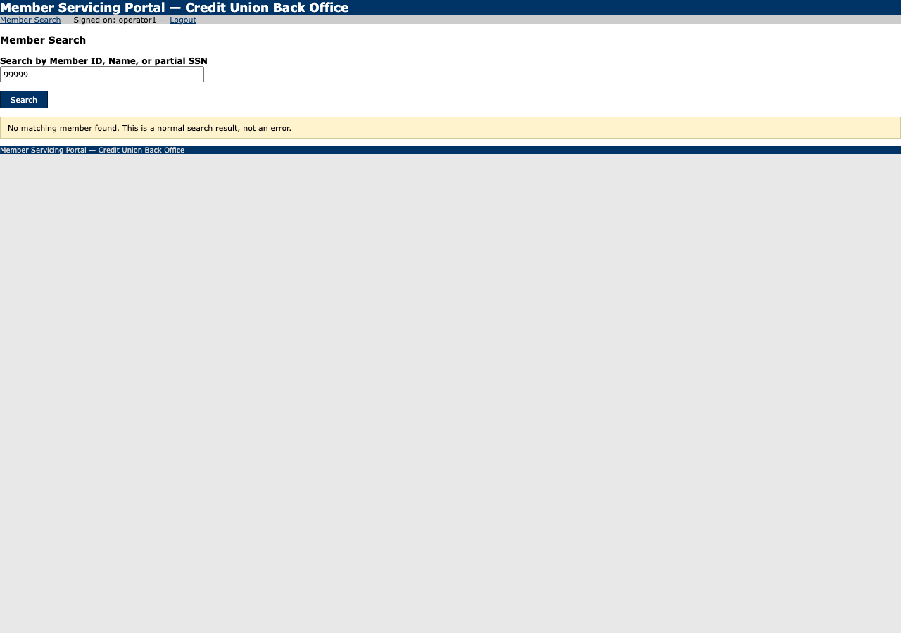

# Run report — lookup_member_and_get_savings_balance

**Run id:** `replay_lookup_member_and_get_savings_balance_20260915T040036_2874a8`  
**Goal:** Look up a member by ID and return their current savings balance.  
**Target:** 127.0.0.1_5050 (web)  
**Started:** 2026-09-15T04:00:36.903363+00:00 · **Duration:** 0.6s · **Outcome:** ❌ Hard failure — `locator_unresolved`

## Steps

### 1. navigate — s0

Navigated to /.
Locator: — · Verified: ✓ · URL: `http://127.0.0.1:5050/login`

### 2. type — s1

Typed {{username}} into textbox "Username" — entered 'operator1'.
Locator: primary · Verified: ✓ · URL: `http://127.0.0.1:5050/login`

### 3. type — s2

Typed {{password}} into textbox "Password" — entered «redacted».
Locator: primary · Verified: ✓ · URL: `http://127.0.0.1:5050/login`

### 4. click — s3

Clicked button "Log In".
Locator: primary · Verified: ✓ · URL: `http://127.0.0.1:5050/members/search`

### 5. navigate — s0

Navigated to /.
Locator: — · Verified: ✓ · URL: `http://127.0.0.1:5050/members/search`

### 6. type — s1

Typed {{member_id}} into textbox "Search by Member ID, Name, or partial SSN" — entered '99999'.
Locator: primary · Verified: ✓ · URL: `http://127.0.0.1:5050/members/search`

### 7. click — s2

Clicked button "Search".
Locator: primary · Verified: ✓ · URL: `http://127.0.0.1:5050/members/search`

### 8. click — s3

Clicked link "10001" — target not found.
Locator: — · Verified: ✗ · URL: `http://127.0.0.1:5050/members/search`

## Result

**Status:** hard_failure

**Outcome code:** `locator_unresolved`

**Failed at step:** `s3`

Step s3: expected role+name='link:{{member_id}}' on http://127.0.0.1:5050/members/search, but no element resolved. Observed instead: cell:Member Servicing Portal — Credit Union Back Office, cell:Member Search Signed on: operator1 — Logout, link:Member Search, link:Logout, heading:Member Search, textbox:Search by Member ID, Name, or partial SSN, button:Search, cell:No matching member found. This is a normal search result, not an error.
