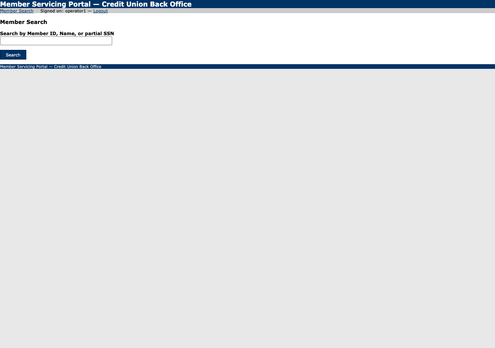
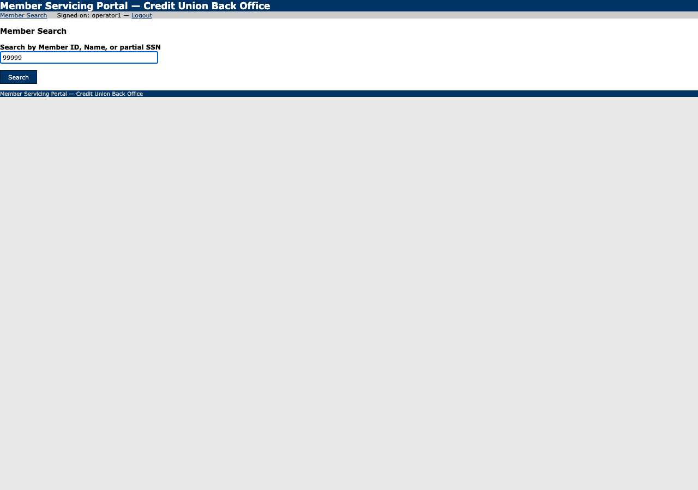

# Run report: lookup_member_and_get_savings_balance

**Run id:** `replay_lookup_member_and_get_savings_balance_20260915T040042_20bdb2`  
**Goal:** Look up a member by ID and return their current savings balance.  
**Target:** 127.0.0.1_5050 (web)  
**Started:** 2026-09-15T04:00:42.589401+00:00 · **Duration:** 0.47s · **Outcome:** ⚠️ Business outcome: `member_not_found`

## Steps

### 1. navigate: s0

Navigated to /.
Locator: n/a · Verified: ✓ · URL: `http://127.0.0.1:5050/login`

### 2. type: s1

Typed {{username}} into textbox "Username", entered 'operator1'.
Locator: primary · Verified: ✓ · URL: `http://127.0.0.1:5050/login`

### 3. type: s2

Typed {{password}} into textbox "Password", entered «redacted».
Locator: primary · Verified: ✓ · URL: `http://127.0.0.1:5050/login`

### 4. click: s3

Clicked button "Log In".
Locator: primary · Verified: ✓ · URL: `http://127.0.0.1:5050/members/search`

### 5. navigate: s0

Navigated to /.
Locator: n/a · Verified: ✓ · URL: `http://127.0.0.1:5050/members/search`

### 6. type: s1

Typed {{member_id}} into textbox "Search by Member ID, Name, or partial SSN", entered '99999'.
Locator: primary · Verified: ✓ · URL: `http://127.0.0.1:5050/members/search`

### 7. click: s2

Clicked button "Search".
Locator: primary · Verified: ✓ · URL: `http://127.0.0.1:5050/members/search`

## Result

**Status:** business_outcome

**Outcome code:** `member_not_found`

Known outcome member_not_found detected
