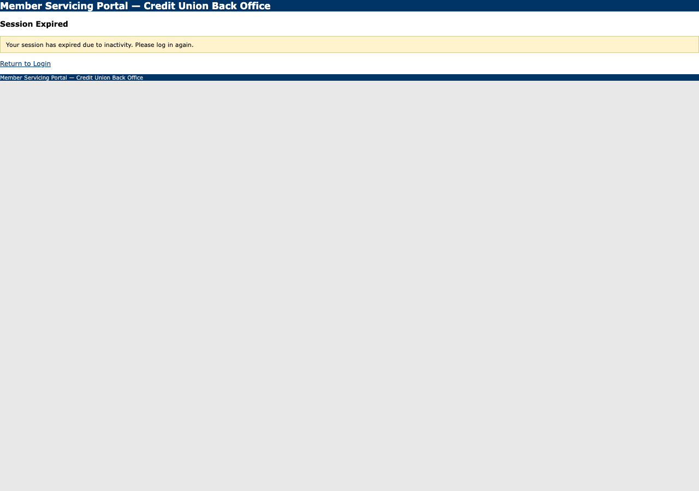

# Run report — lookup_member_and_get_savings_balance

**Run id:** `replay_lookup_member_and_get_savings_balance_20260915T040110_d1c846`  
**Goal:** Look up a member by ID and return their current savings balance.  
**Target:** 127.0.0.1_5050 (web)  
**Started:** 2026-09-15T04:01:10.858074+00:00 · **Duration:** 0.06s · **Outcome:** 🔁 Recoverable — `session_expired`

## Steps

### 1. navigate — s0

Navigated to /.
Locator: — · Verified: ✓ · URL: `http://127.0.0.1:5051/session-expired`

## Result

**Status:** recoverable

**Outcome code:** `session_expired`

The operator session expired part-way through the flow.
